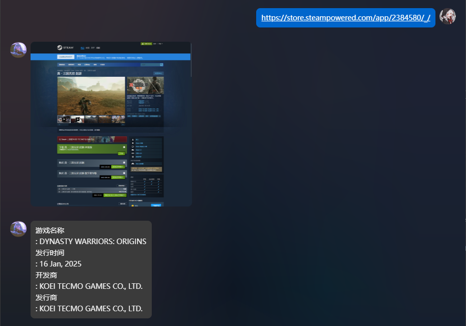
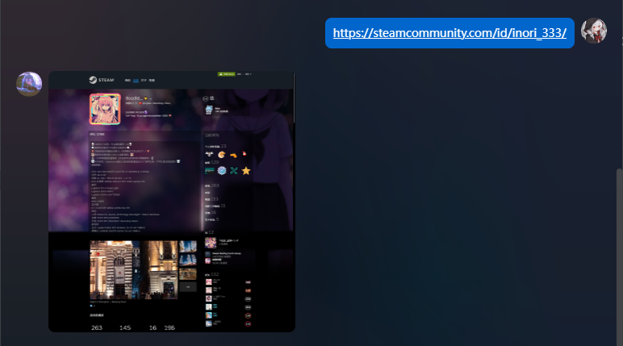

# Check Steam-Link V1.4.5

一个AstrBot插件。
A plugin for AstrBot.

# 功能介绍
## 已实现
- 自动检测对话中出现的steam商店页链接，并返回对应页面的网页截图和摘要信息。
- 更详细的信息解析。
- 检测steam个人主页链接，并返回个人主页截图。
  目前支持的格式如下：
```
https://store.steampowered.com/app/881020/Granblue_Fantasy_Relink/ # 游戏商店页链接
https://steamcommunity.com/id/inori_333/ # 个人主页链接
```
可解析的信息：
```
游戏名称
发行时间
开发商
发行商
游戏类别（保留前五个）
游戏简介
游戏评分
游戏价格
是否支持中文（包括简体中文和繁体中文）
```
## 待实现
- 返回更更详细的商店页文字信息。
- 返回与链接游戏相关的其他信息，比如从SteamDB获取的价格变化等等。
- 支持参数设置，比如是否需要返回截图，截屏的宽度和高度，返回摘要的详细等级等等。

# 使用方法
## 软件依赖
程序依赖无头参数下的Chrome浏览器进行本地截屏，**您的主机需要安装Chrome浏览器以及对应的ChromeDriver驱动**。
## 第三方库依赖
程序依赖以下第三方库：
- selenium
- webdriver-manager
- requests
- beautifulsoup4

但是，您应该无需手动安装任何第三方库，也无需手动安装chrome驱动，本插件会自动检测您的环境，并安装缺失的库和驱动。
即，**唯一的必要条件：您的astrbot运行环境需要有Chrome浏览器。**

## 前端使用
无需使用任何指令，插件会自动检测对话中出现的steam链接，并返回对应页面的网页截图和摘要信息。
(当然目前也不支持任何指令就是了)

# 使用示例



# 更新记录
## v1.2.0
+ 对steam个人主页链接的监听（返回个人主页截图）
+ 对游戏商店页内容更详细的解析（返回文本）

## v1.3.0
+ 修复了发行商异常换行
+ 自动获取ChromeDriver
+ 异步运行，防止因网络原因卡死astrbot，失败时自动重试

## v1.4.0
+ 修复了打折游戏价格无法正常显示的bug
+ 支持steam网页完整截图

## v1.4.5
+ 支持绕过steam年龄验证界面

# 支持
[帮助文档](https://github.com/inori-3333/astrbot_plugin_steamshot)
