# Check Steam-Link V1.8.2

+ 一个AstrBot插件。A plugin for AstrBot.
> 如果您觉得对您有用，请点一个star，我会学猫娘叫。
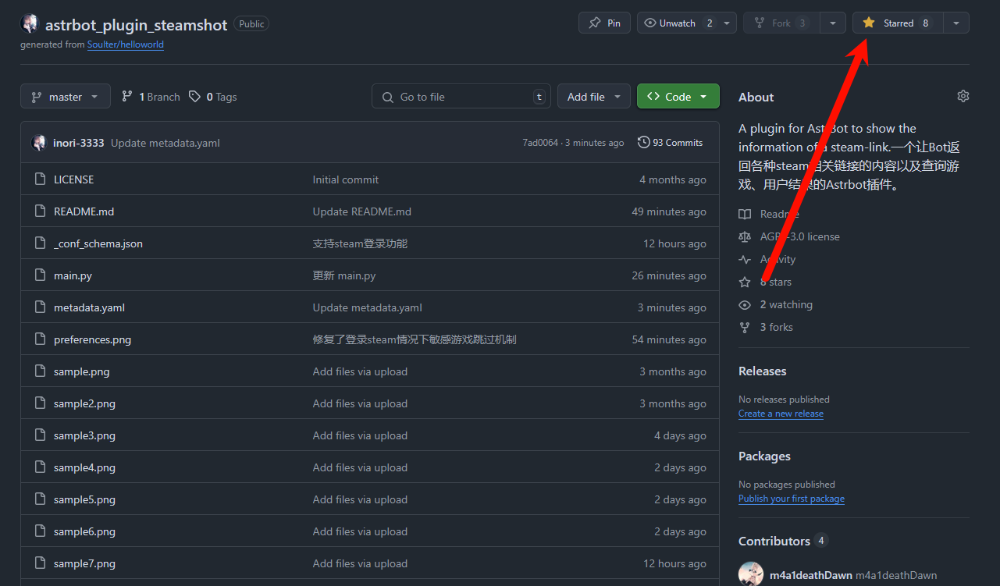
> 当前版本：v1.8.2

# 功能介绍
## 已实现
自动检测对话中出现的如下内容，并返回对应页面的网页截图和摘要信息：
- steam商店页链接
- steam个人主页链接
- steam创意工坊链接

  目前支持的格式如下：
```
https://store.steampowered.com/app/881020/Granblue_Fantasy_Relink/ # 游戏商店页链接
https://steamcommunity.com/id/inori_333/ # 个人主页链接
https://steamcommunity.com/sharedfiles/filedetails/?id=3472726693 # 创意工坊物品链接
```
可解析的信息：
```
steam商店界面:
游戏名称
发行时间
开发商
发行商
游戏类别（保留前五个）
游戏简介
游戏评分
游戏价格
是否支持中文（包括简体中文和繁体中文）

steam个人资料界面:
用户名称
封禁记录
个人简介
steam等级
地区
当前状态
游戏数
好友数
最新动态

steam创意工坊界面:
游戏名称
创意工坊作品名称
作者名称
作者主页链接
作者状态
评分
文件大小
创建日期
更新日期
标签
描述
```
## 待实现
- 返回与链接游戏相关的其他信息，比如从SteamDB获取的价格变化等等。
- 支持参数设置，比如是否需要返回截图，截屏的宽度和高度，返回摘要的详细等级等等。
- 支持解析steam个人隐私允许条件下的所有steam好友的状态，比如好友是否在线，好友正在玩什么游戏等等。
- 支持在搜索steam商店和用户时，返回前x个选项（若有），通过回复指定序号解析指定页面

# 使用方法
## 软件依赖
程序依赖无头参数下的Chrome浏览器进行本地截屏，**您的主机需要安装Chrome浏览器以及对应的ChromeDriver驱动**。
## 第三方库依赖
程序依赖以下第三方库：
- selenium
- webdriver-manager
- requests
- beautifulsoup4

但是，您应该无需手动安装任何第三方库，也无需手动安装chrome驱动，插件会自动检测您的环境，并安装缺失的库和驱动。
即，**唯一的必要条件：您的astrbot运行环境需要有Chrome浏览器。**

## 自动检测使用示例
_以下两个示例为v1.0.0版本，当前使用效果请查看更新日志中新的示例。_


## 指令使用指南
根据收到的steam链接自动解析指定界面，插件会自动检测对话中出现的steam链接，并返回对应页面的网页截图和摘要信息（现仅支持steam商店界面、个人主页界面和创意工坊界面）。
```
使用  /sss  指令搜索steam商店，使用方法: /sss + 游戏名，如: /sss 不/存在的你，和我
使用  /ssu  指令搜索steam用户，使用方法: /ssu + 用户名，如: /ssu m4a1_death-Dawn
```

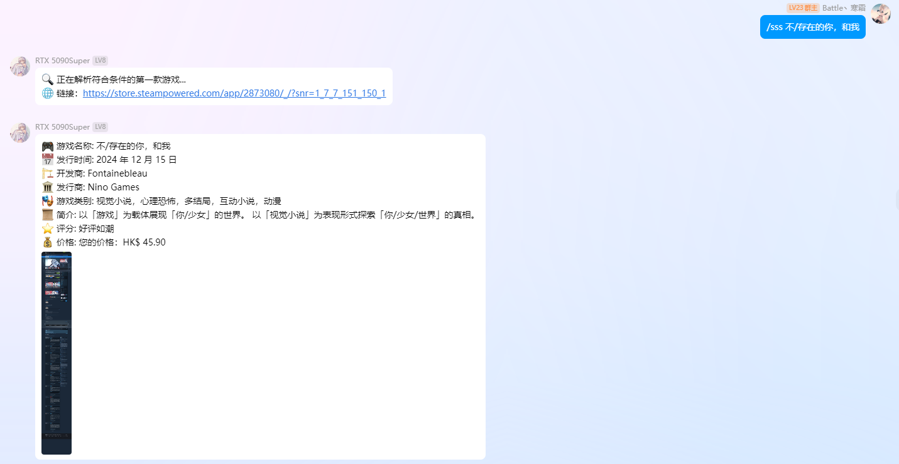
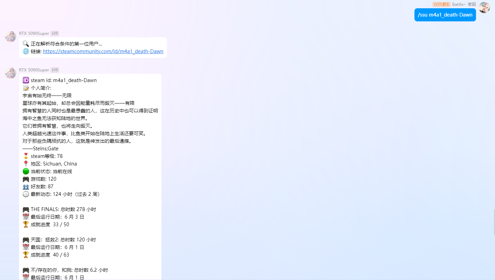

```
使用  /ssl  指令进行steam登录操作，具体使用方法：
  /ssl enable - 启用steam登录功能
  /ssl disable - 禁用steam登录功能
  /ssl status - 查看当前登录状态
  /ssl store [cookies文本] - 设置Steam商店cookies
  /ssl community [cookies文本] - 设置Steam社区cookies
  /ssl test - 测试Steam登录状态
```

注意**steam商店和steam社区的cookies要分开设置**，steam商店的域名对应steampowered.com，steam社区的域名对应steamcommunity.com，**两者cookies不能通用**  

**获取cookies的方法**：打开浏览器 - 进入steam网页登录你的steam账号 - （按F12）调出开发者工具 - 选择网络/Network选项 - 进入一个steam网页 - 选择名称排在最上面那个项 - 右边那个标头/header里面向下拉 - 找到请求标头/request header项 - 把其中的cookies复制  

这只是一种获取steam cookies的方法，其他还有很多方法，但最好填写完整的cookies，只填写部分的cookies可能会报错  
这就是你的cookies，请保存好，不要泄露，通过指令的方式或者填入Astrbot网页图形ui中插件管理 - Check Steam-Link 插件配置栏中的 input 输入框中  

**强烈建议您在获取steam cookies前，配置好您的偏好设置，避免搜索时出现不必要的bug**
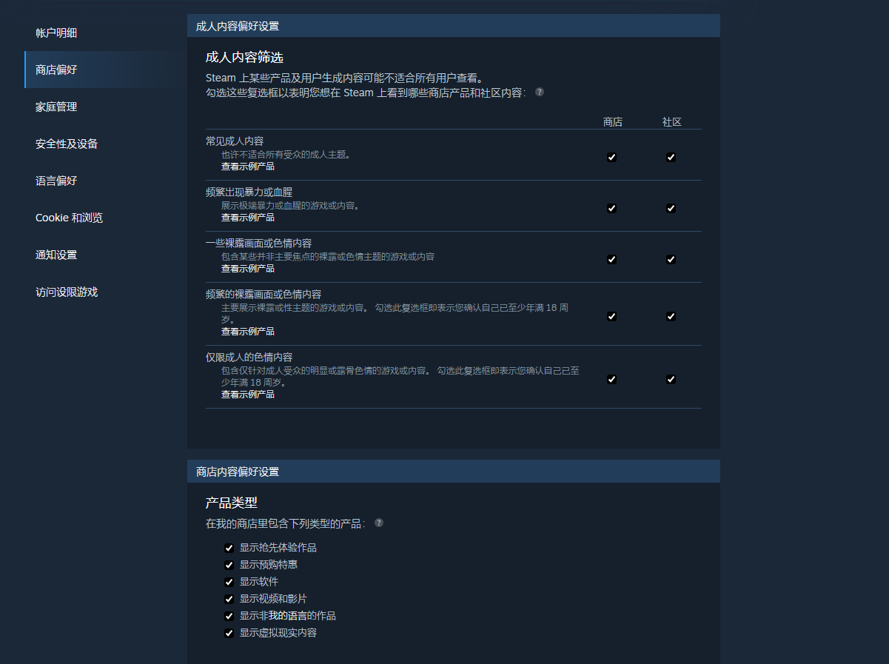

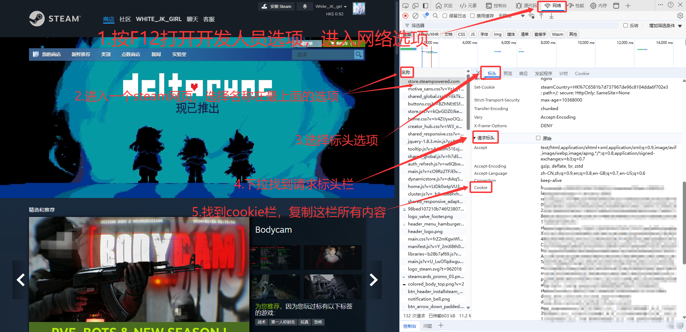
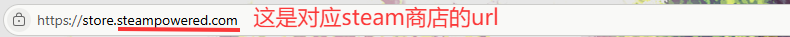
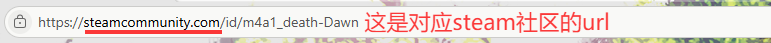
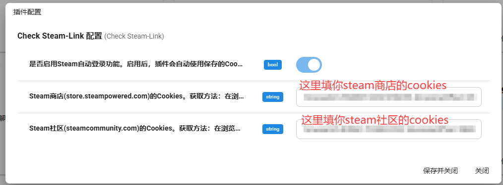
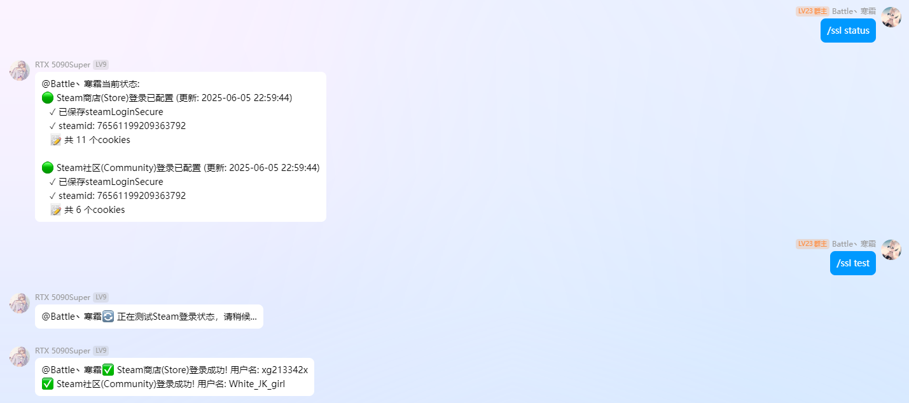

**注意：当你进入的是前缀为steampowered.com的steam网页时，对应的cookies是steam商店cookies；当你进入的是前缀为steamcommunity.com的网页时，对应的cookies是steam社区的cookies。请不要填错了！！！**  
**注意：当你进入的是前缀为steampowered.com的steam网页时，对应的cookies是steam商店cookies；当你进入的是前缀为steamcommunity.com的网页时，对应的cookies是steam社区的cookies。请不要填错了！！！**  
**注意：当你进入的是前缀为steampowered.com的steam网页时，对应的cookies是steam商店cookies；当你进入的是前缀为steamcommunity.com的网页时，对应的cookies是steam社区的cookies。请不要填错了！！！**  


# 更新记录
## v1.2.0
+ 对steam个人主页链接的监听（返回个人主页截图）
+ 对游戏商店页内容更详细的解析（返回文本）

## v1.3.0
+ 修复了发行商异常换行
+ 自动获取ChromeDriver
+ 异步运行，防止因网络原因卡死astrbot，失败时自动重试

## v1.4.0
+ 修复了打折游戏价格无法正常显示的bug
+ 支持steam网页完整截图

## v1.4.5
+ 支持绕过steam年龄验证界面

## v1.5.0
+ 新增支持steam主页解析功能

## v1.6.0
+ 新增支持steam创意工坊解析功能
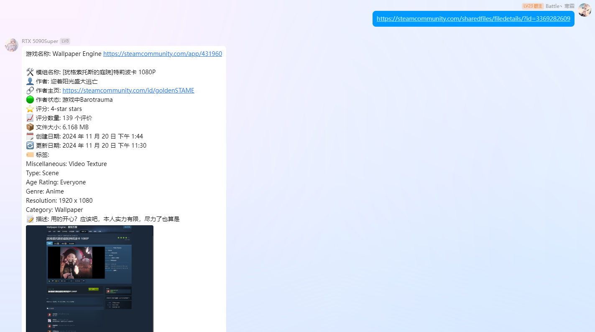

## v1.6.1
+ 支持解析steam主页最新动态，并改善排版
+ 支持解析steam个人简介中的链接（之前考虑到可能会有些不良链接，不过现在还是觉得应该问题不大，还是放出来了）
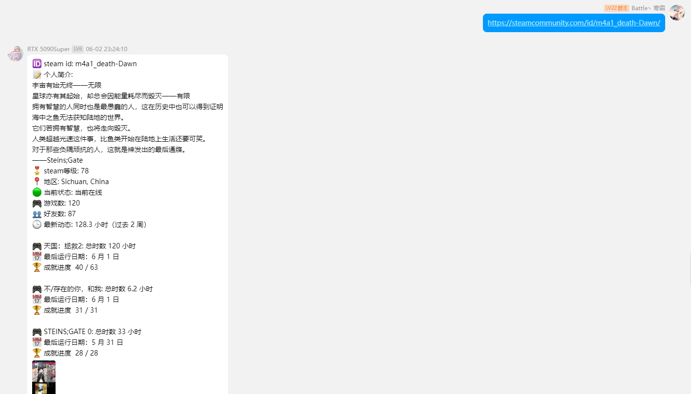

## v1.6.3
+ 新增支持steam个人主页封禁记录解析
+ 修复了chrome自动更新导致的chromedriver版本不匹配的问题，如果控制台返回chromedriver版本不匹配，重载插件即可解决

## v1.6.5
+ 修复了steam创意工坊解析的bug
+ 完善Steam创意工坊链接处理功能

## v1.7.0
+ 新增搜索steam商店和搜索steam用户指令

## v1.8.0
+ 新增支持通过保存cookies的方式登录steam（注意：steam商店和steam社区两个的cookies不一样，请不要填错了）

## v1.8.1
+ 修复了登录状态下steam商店敏感游戏验证无法跳过的问题
+ 修复了登录状态下steam商店可能有些游戏搜不到的问题

## v1.8.2
+ 优化了steam商店界面价格部分的解析

# 支持
[帮助文档](https://github.com/inori-3333/astrbot_plugin_steamshot)
